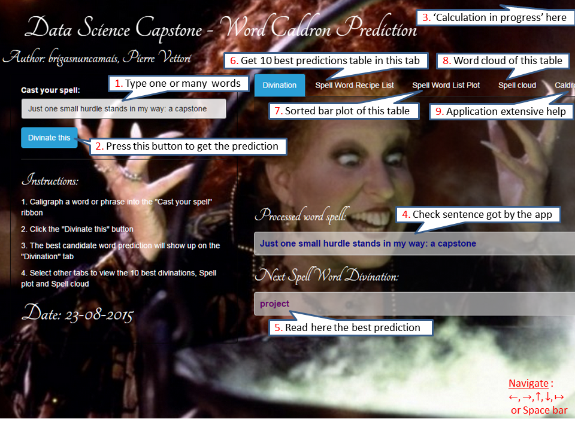

# DSCaptoneShinyApp
2015 NLP DataScience Capstone
---
# Data Science Capstone Project - Milestone Report
---

<div>
<a href="http://brigasnuncamais.shinyapps.io/DSCapstoneShinyApp/" target="_blank">
</a>
</div>

### Executive Summary  
This Capstone Project is run in collaboration with Swiftkey, a successful British company building smartphone ergonomic virtual keyboard softwares. As with these apps, our focus is here to predict the next word to be typed in an input field to increase user's productivity. On smartphones, resources are limited. So we have to solve a trade-off between prediction model size and its efficiency.  

The present Milestone Report aims at giving the steps and orientation I will choose for this project in order to deliver the best possible solution.

### Data acquisition and cleaning  
The training data set is based on 3 text files corpora (blogs, news and twitts) in 4 different languages (english, german, finish and russian). They can be found [here](https://d396qusza40orc.cloudfront.net/dsscapstone/dataset/Coursera-SwiftKey.zip).

Analyzing the Source files, we collected the following metrics:

File  | Lines | Words | Characters
----- | ----- | ----- | -----------
en_US.blogs.txt | 899288 | 37334131 | 210160014
en_US.news.txt | 1010242 | 34372529 | 205811889
en_US.twitter.txt | 2360148 | 30373583 | 167105338
----- | ----- | ----- | -----------
total | 4269678 | 102080243 | 583077241

File  | Lines | Words | Characters
----- | ----- | ----- | -----------
de_DE.blogs.txt | 371440 | 12653019 | 85459666
de_DE.news.txt | 244743 | 13219287 | 95591959
de_DE.twitter.txt | 947774 | 11803491 | 75578341
----- | ----- | ----- | -----------
total | 1563957 | 37675797 | 256629966

File  | Lines | Words | Characters
----- | ----- | ----- | -----------
fi_FI.blogs.txt | 439785 | 12731005 | 108503595
fi_FI.news.txt | 485758 | 10445964 | 94234350
fi_FI.twitter.txt | 285214 | 3152758 | 25331142
----- | ----- | ----- | -----------
total | 1210757 | 26329727 | 228069087

File  | Lines | Words | Characters
----- | ----- | ----- | -----------
ru_RU.blogs.txt | 337100 | 9405378 | 116855835
ru_RU.news.txt | 196360 | 9115829 | 118996424
ru_RU.twitter.txt | 881414 | 9223841 | 105182346
----- | ----- | ----- | -----------
total | 1414874 | 27745048 | 341034605


```{r, echo = FALSE}
require("readr")
Sys.setlocale("LC_ALL","C")
sampleInd <- function(data, fraction)
{
    sampleSize <- round(length(data) * fraction)[1]
    sampleIndex <- sample.int(length(data), sampleSize, replace = FALSE)
    return(sampleIndex)
}
RawTextFilename <- "./final/en_US/en_US.blogs.txt"
system.time(BlogData <- read_lines(RawTextFilename,10))

RawTextFilename <- "./final/en_US/en_US.news.txt"
NewsData <- read_lines(RawTextFilename)

RawTextFilename <- "./final/en_US/en_US.twitter.txt"
TwitterData <- read_lines(RawTextFilename)

# 20% of data in training set
sampInd <- sampleInd(BlogData,.2)
InTrainingBlogs <- BlogData[sampInd]
InTestingBlogs <- BlogData[-sampInd]

```

### Data exploration  
Printing samples of our source data, for instance in blogs, I found that:
- Many blogs, news and twitts are written in several sentences. Finding whether a word is used at the start or the end of a sentence seems very important to me. So I will produce 3 text files of sentences in lowercase, without punctuation, splitting original text accordingly.  
- Many characters in twitts are smileys, sometimes with sophisticated extended characters. I will simply delete them.  
- As my model will be founded on a basic n-gram, I don't want to register bi-grams of words who were originally on each side of a point.  
- So my first cleaning step will be to separate sentences. So for a same word, I will make a distinction between tokens that start a sentence, are part of of the middle of a bi-gram, or end a sentence.  
- I will take care of different types of apostrophe (like `\u2018,\u2019,\u201b`, changing them all to `'`.  
- I don't need the quotes around ngrams, I will remove them.  
- When removing punctuation, I will keep the english contractions and count the word with its contraction as a single token.  
- I will keep dashes inside words but discard dashes framed by one or more spaces. So starting dashes used as bullet points will be discarded as well.  
- As a final cleaning step I will put all words in lowercase, strip numbers and extra whitespaces.  

### First Simple N-gram model  

- The 3 US initial cleaned text files above have been fed into the specific tool I choose : [SRI Language Model Toolkit in C++](http://www.speech.sri.com/projects/srilm).  
- As a first step I compiled the tools embedded in this package, using free Visual Studio.  
- One specifically called `ngram-count` allows me to output a ngram model. I choose to limit it to 1,2 and 3grams. The output file follows the [ARPA](http://specificURL) standard.  
- Another tool: `ngram` let me test the above model on a testing file. I build a file with all the combinations of Quizz 2. The output of this test are the probabilities of each sentence, and its perplexity, with and without end of sentence.  

### Top ngram Probabilities  

The output from this model can be loaded back in R and shown in a Word Cloud. A couple of barplots show the top word probabilities.  
```{r costs,fig.width=10,fig.height=7,fig.align='center',cache=FALSE, echo = FALSE}
require(ggplot2)
require(gridExtra)
require(wordcloud)

load("plot123n10.RData")

plot1 <- ggplot(plot1n10) +
  geom_bar(aes(x=ngram,y=log10Prob,fill=log10Prob),stat = "identity",color="black") + 
  ggtitle("Top 10 1grams ") + coord_flip() +
  ylab("log10 of probabilities") + xlab("1grams") +
  theme(axis.text.y = element_text(angle = 45, hjust = 1,colour = "black"))
plot2 <- ggplot(plot2n10) +
  geom_bar(aes(x=ngram,y=log10Prob,fill=log10Prob),stat = "identity",color="black") + 
  ggtitle("Top 10 2grams") + coord_flip() + 
  ylab("log10 of probabilities") + xlab("2grams") +
  theme(axis.text.y = element_text(angle = 45, hjust = 1,colour = "black"))
plot3 <- ggplot(plot3n10) +
  geom_bar(aes(x=ngram,y=log10Prob,fill=log10Prob),stat = "identity",color="black") + 
  ggtitle("Top 10 3grams") + coord_flip() +
  ylab("log10 of probabilities") + xlab("3grams") +
  theme(axis.text.y = element_text(angle = 45, hjust = 1,colour = "black"))
suppressWarnings(grid.arrange(plot1, plot2, plot3, ncol=2))

par(mfrow=c(2,2))
wordcloud(plot1n10$ngram, abs(plot1n10$log10Prob),scale=c(2,7), max.words = 10, 
          colors = brewer.pal(6, "Dark2"), rot.per = 0.5)
text(x = 0.5, y = 1, "Top 10 Unigrams Word Cloud")

wordcloud(plot2n10$ngram, abs(plot2n10$log10Prob),scale=c(0.8,3), max.words = 10, 
          colors = brewer.pal(6, "Dark2"), rot.per = 0.5)
text(x = 0.5, y = 1,"Top 10 Bigrams Word Cloud")

wordcloud(plot3n10$ngram, abs(plot3n10$log10Prob),scale=c(1,5), max.words = 10, 
          colors = brewer.pal(6, "Dark2"), rot.per = 0.5)
text(x = 0.5, y = 1, "Top 10 Trigrams Word Cloud")
```

### Strategy to work around performance issue  
- Seeing my peers into trouble when using certain R libraries to generate n-grams, I choose to limit my development steps designed in R.  
- I will only clean the data in R and output files of sentences, in lowercase and with no punctuation. Even that limitation was hard to stand as my 6Gb machine was soon reaching its limits. Another issue is the Java libraries that are even slower and need certain memory parameters to be considered, unless one can see its job fail out of memory.  
- The core of my solution is the open source `SRI Language Model Toolkit` compiled in C++. The good thing is that it takes few minutes to deliver its model. I still have lots of tuning (discounts, smoothing) at my disposal to refine my model.  
- I will write a function in R to load the ARPA file in a dataset. I will then be able to show statistics.  

### Perspectives for the remaining weeks  
- This R function will also be the base for a representation of n-grams used by the Shinyapp application.  
- I plan to use a profanity filter on the output side of this application. 
- I need to increase the word coverage
- Prune the model from lower frequency words to fit the accuracy / performance trade-off. The threshold for this has still to be determined. But anyway this will be the last step to fit into Shinyapp memory, as it is a weak of smoothing low represented ngrams (cf Dan Jurafsky - Stanford).

### Conclusions  
- I initially planned to rush through this project and finish it in one month. I realize I was too greedy as it requires a lot of investigation, tries and errors, mistakes and bugs to solve, more research on Internet to change one's strategy. In fact I think I will finish this report in the last permitted hour beofre due date. And there will still be a lot to do before I can deliver a neatly working application at the end of next month.


### Appendix 1 ###   

```{r, echo = FALSE}
sessionInfo()
```
